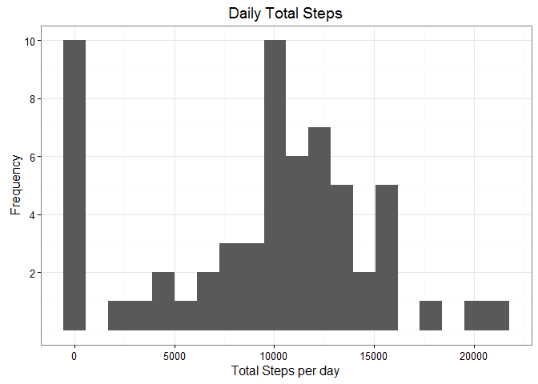
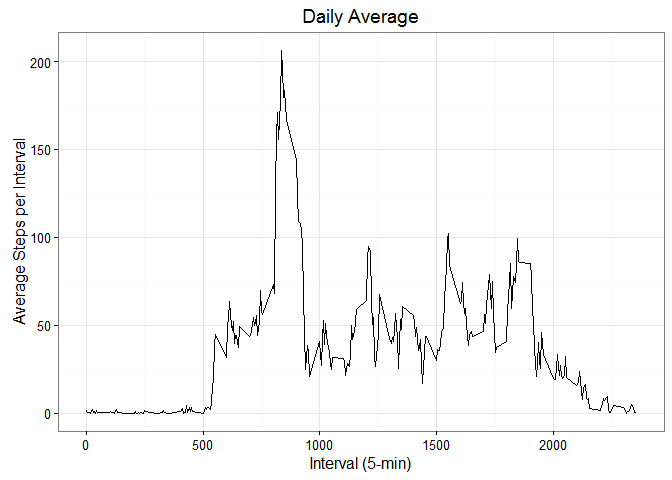
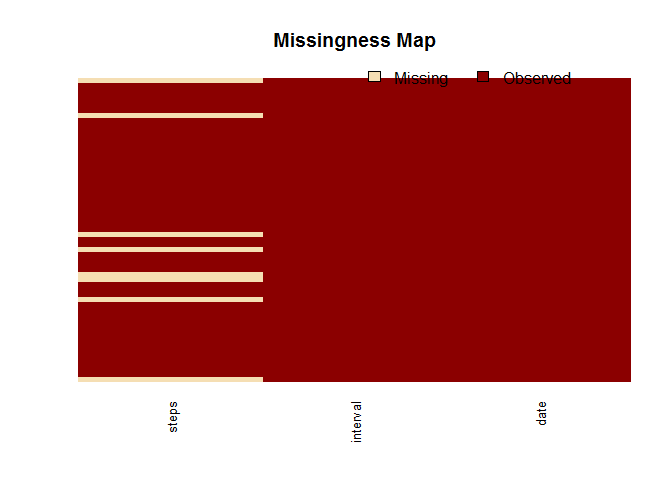
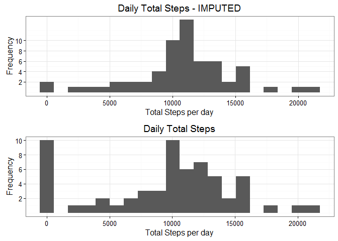
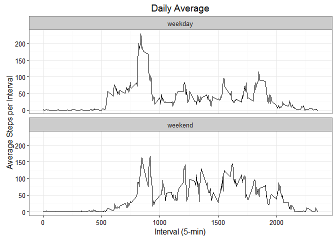

# Reproducible Research: Peer Assessment 1
Steffen Ruefer  


Prior to loading the data, the libraries required for data processing and plotting should be 
installed and loaded (not shown in this report).
These packages are: `dplyr`, `ggplot2`, `gridExtra`, `Amelia`. 


## Loading and preprocessing the data

The data is loaded from the CSV file and the date feature is converted into date format.


```r
x.df <- read.csv("activity.csv")          # Read csv
x.df$date <- as.Date(x.df$date)           # convert from chr to date
```

Afterwards, the data is summarized to get some initial information about it.


```r
summary(x.df)
```

```
##      steps             date               interval     
##  Min.   :  0.00   Min.   :2012-10-01   Min.   :   0.0  
##  1st Qu.:  0.00   1st Qu.:2012-10-16   1st Qu.: 588.8  
##  Median :  0.00   Median :2012-10-31   Median :1177.5  
##  Mean   : 37.38   Mean   :2012-10-31   Mean   :1177.5  
##  3rd Qu.: 12.00   3rd Qu.:2012-11-15   3rd Qu.:1766.2  
##  Max.   :806.00   Max.   :2012-11-30   Max.   :2355.0  
##  NA's   :2304
```

The summary shows that there are **2304 NA's** in the `steps` feature.


## What is mean total number of steps taken per day?

To answer this question, some data processing is applied. Firstly, the initial data frame is 
converted into a table format with the **dplyr** package and saved as new variable.


```r
x.tbl <- tbl_df(x.df)
class(x.tbl)
```

```
## [1] "tbl_df"     "tbl"        "data.frame"
```

### 1) Total Steps per Day

By grouping the data set by date, the daily total steps can be calculated as below. The first 6 
rows of the summarized data set are displayed.


```r
x.by.date <- group_by(x.tbl, date) %>% summarise(total_steps = sum(steps, na.rm = TRUE))
head(x.by.date)
```

```
## Source: local data frame [6 x 2]
## 
##         date total_steps
##       (date)       (int)
## 1 2012-10-01           0
## 2 2012-10-02         126
## 3 2012-10-03       11352
## 4 2012-10-04       12116
## 5 2012-10-05       13294
## 6 2012-10-06       15420
```


### 2) Histogram of Daily Steps

The histogram 


```r
p1 <- ggplot(x.by.date, aes(total_steps)) +             # call plot function
      geom_histogram(bins = 20) +                       # number of bins = 20
      theme_bw() +                                      # use bw theme
      ggtitle("Daily Total Steps") +                    # set plot title
      xlab("Total Steps per day") +                     # set x-axis label
      ylab("Frequency") +                               # set y-axis label
      scale_y_continuous(breaks = c(2, 4, 6, 8, 10))    # set y-axis tick values
p1    # print plot
```




### 3) Mean and Median of Daily Steps

Mean and median values are calculated from the summarized data set:


```r
mean_steps <- round(mean(x.by.date$total_steps, na.rm = TRUE), digits = 0)
median_steps <- median(x.by.date$total_steps, na.rm = TRUE)
```

Mean number of daily steps are **9354**, and median number of daily steps are 
**10395**, showing a large difference between the two values. NA's were removed from 
this calculation.


## What is the average daily activity pattern?

### 1) Time Series Plot

A time series plot can be created by grouping the data by *interval*.


```r
x.by.interval <- group_by(x.tbl, interval) %>% 
                 summarise(avg_steps = mean(steps, na.rm = TRUE))
p2 <- ggplot(x.by.interval, aes(x = interval, y = avg_steps)) + 
      geom_line() + 
      ggtitle("Daily Average") +
      xlab("Interval (5-min)") +
      ylab("Average Steps per Interval") +
      theme_bw()
p2
```



### 2) Maximum Steps Interval


```r
max_steps <- round(max(x.by.interval$avg_steps, na.rm = TRUE), digits = 0)
max_interval <- x.by.interval[which.max(x.by.interval$avg_steps), 1]
```

The interval with the maximum steps is **835**, with 206 steps.


## Imputing missing values

### 1) Number of NA's (incomplete rows)

As found already in the first section, the number of NA's is 2304, in the steps feature. In all
cases, entire days are missing. There are no dates where some data are missing and some are 
present. 
By using the `Amelia` package, the NA's can be visualized.


```r
missmap(x.df, y.labels = c(), y.at = c())
```



### 2) Imputation Strategy

NA's will be replaced by the mean number of steps per interval.


### 3) Dataset with Imputed Values


```r
# Step 1: create new data set by copying old one
x2.df <- x.df
str(x2.df)
```

```
## 'data.frame':	17568 obs. of  3 variables:
##  $ steps   : int  NA NA NA NA NA NA NA NA NA NA ...
##  $ date    : Date, format: "2012-10-01" "2012-10-01" ...
##  $ interval: int  0 5 10 15 20 25 30 35 40 45 ...
```

```r
# Step 2: Loop through each row and if NA then replace with mean of interval
for (i in 1:nrow(x2.df)) {
      # Impute for NA's
      if (is.na(x2.df$steps[i])) {
            x2.df$steps[i] <- round(x.by.interval$avg_steps[x.by.interval$interval == x2.df$interval[i]], 0)
      }
}

# Step 3: Summary of data
summary(x2.df)
```

```
##      steps             date               interval     
##  Min.   :  0.00   Min.   :2012-10-01   Min.   :   0.0  
##  1st Qu.:  0.00   1st Qu.:2012-10-16   1st Qu.: 588.8  
##  Median :  0.00   Median :2012-10-31   Median :1177.5  
##  Mean   : 37.38   Mean   :2012-10-31   Mean   :1177.5  
##  3rd Qu.: 27.00   3rd Qu.:2012-11-15   3rd Qu.:1766.2  
##  Max.   :806.00   Max.   :2012-11-30   Max.   :2355.0
```

```r
str(x2.df)
```

```
## 'data.frame':	17568 obs. of  3 variables:
##  $ steps   : num  2 0 0 0 0 2 1 1 0 1 ...
##  $ date    : Date, format: "2012-10-01" "2012-10-01" ...
##  $ interval: int  0 5 10 15 20 25 30 35 40 45 ...
```

Result: no more NA's in *steps*.

### 4) Histogram made with new dataset

To evaluate the result of the imputation, first we compare histograms.


```r
# Step 1: convert imputed data set to table format and group by date
x2.tbl <- tbl_df(x2.df)
x2.by.date <- group_by(x2.tbl, date) %>% 
              summarise(total_steps = sum(steps))

# Step 2: Create new Histogram, compare with old one by arranging them on top of each other.
p1B <- ggplot(x2.by.date, aes(total_steps)) +            # call plot function
       geom_histogram(bins = 20) +                       # number of bins = 20
       theme_bw() +                                      # use bw theme
       ggtitle("Daily Total Steps - IMPUTED") +          # set plot title
       xlab("Total Steps per day") +                     # set x-axis label
       ylab("Frequency") +                               # set y-axis label
       scale_y_continuous(breaks = c(2, 4, 6, 8, 10))    # set y-axis tick values
grid.arrange(p1B, p1, nrow = 2)
```



The histograms show a similar shape; the main difference is that the bin with zeroes has decreased
compared to the old histogram.


```r
mean_steps_2 <- round(mean(x2.by.date$total_steps), digits = 0)
median_steps_2 <- median(x2.by.date$total_steps)
print(paste0("Mean = ", mean_steps_2, " steps"))
```

```
## [1] "Mean = 10766 steps"
```

```r
print(paste0("Median = ", median_steps_2, " steps"))
```

```
## [1] "Median = 10762 steps"
```

The mean and median values are larger than the previous ones, with the mean value showing the 
largest change. This is because the number of total steps per day has increased for the dates 
with missing data from zero to average values, as observed at the first row printed below.


```r
head(x2.by.date)
```

```
## Source: local data frame [6 x 2]
## 
##         date total_steps
##       (date)       (dbl)
## 1 2012-10-01       10762
## 2 2012-10-02         126
## 3 2012-10-03       11352
## 4 2012-10-04       12116
## 5 2012-10-05       13294
## 6 2012-10-06       15420
```

The new value for the first row is now 10762, compared to zero previously.


## Differences in Activity Patterns between Weekdays and Weekends

To display the difference in activity patterns between weekdays and weekends, additional features 
are added, the data will be consolidated and then plotted using the `facet_wrap` function.

### 1) New Factor Variable: Weekend and Weekday


```r
# Step 1: add "day" and "day.type" features to the data set
x2.df$day <- weekdays(x2.df$date)           # New feature "day"
x2.df$day.type <- "weekday"                 # New feature: "day.type"
x2.df$day.type[x2.df$day %in% c("Saturday", "Sunday")] <- "weekend"  # change day.type where needed

# Step 2: convert to factors
x2.df$day.type <- factor(x2.df$day.type)
x2.df$day <- factor(x2.df$day, 
                    levels = c("Monday", "Tuesday", "Wednesday", 
                               "Thursday", "Friday", "Saturday", "Sunday"))

# Step 3: create table format data set
x2.tbl <- tbl_df(x2.df)
str(x2.tbl)
```

```
## Classes 'tbl_df', 'tbl' and 'data.frame':	17568 obs. of  5 variables:
##  $ steps   : num  2 0 0 0 0 2 1 1 0 1 ...
##  $ date    : Date, format: "2012-10-01" "2012-10-01" ...
##  $ interval: int  0 5 10 15 20 25 30 35 40 45 ...
##  $ day     : Factor w/ 7 levels "Monday","Tuesday",..: 1 1 1 1 1 1 1 1 1 1 ...
##  $ day.type: Factor w/ 2 levels "weekday","weekend": 1 1 1 1 1 1 1 1 1 1 ...
```

### 2) Time Series Panel Plot

Two separate summarized data sets are created and then merged together as data for the time series 
plot.


```r
# Step 4: create grouped, summarized data sets
wd <- filter(x2.tbl, day.type == "weekday") %>%
      group_by(interval) %>%
      summarise(avg_steps = round(mean(steps), 1), day.type = "weekday")

we <- filter(x2.tbl, day.type == "weekend") %>%
      group_by(interval) %>%
      summarise(avg_steps = round(mean(steps), 1), day.type = "weekend")

# Step 5: combined them
x3.tbl <- rbind(wd, we)
x3.tbl$day.type <- factor(x3.tbl$day.type)

# Step 6: Create Panel Plot
p4 <- ggplot(x3.tbl, aes(x = interval, y = avg_steps)) +
      facet_wrap(~day.type, nrow = 2) +
      geom_line() +
      ggtitle("Daily Average") +
      xlab("Interval (5-min)") +
      ylab("Average Steps per Interval") +
      theme_bw()
p4
```



In gerenal, the plots are similar in shape. However, there are differences at the left and ride
side of the graph, and during weekends the activity is more evenly spread across the day. 

Possible interpretations:

- At weekdays, you need to stand up earlier to go to work
- At weekday, if it is an office job, walking would be less (but not at lunch time)
- At weekends, you might go outside and do sports, while lunch might be at home.


